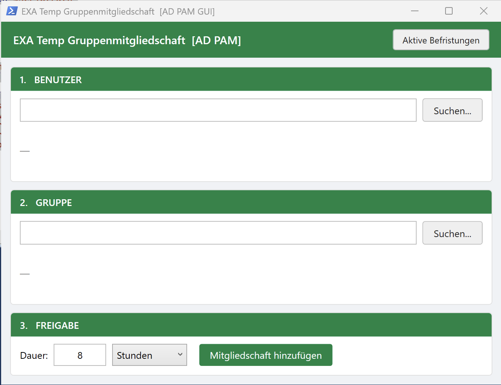
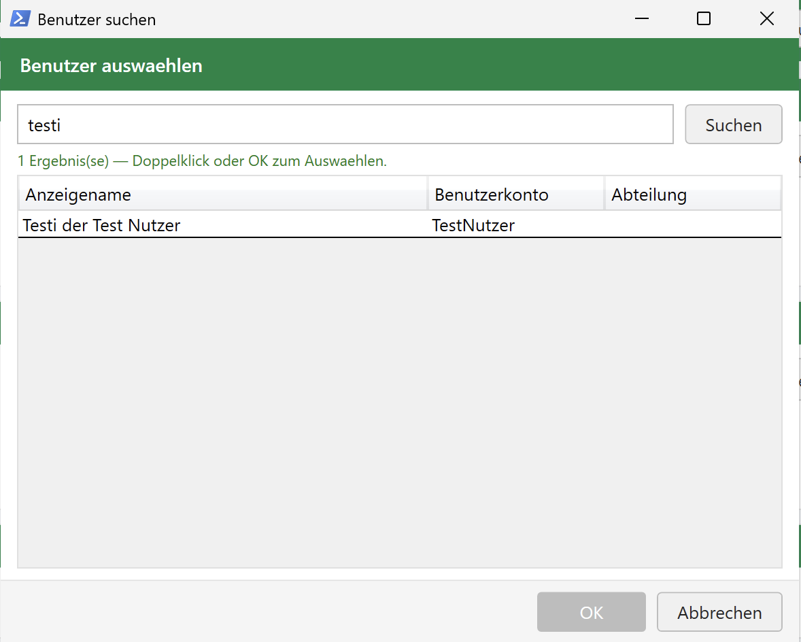
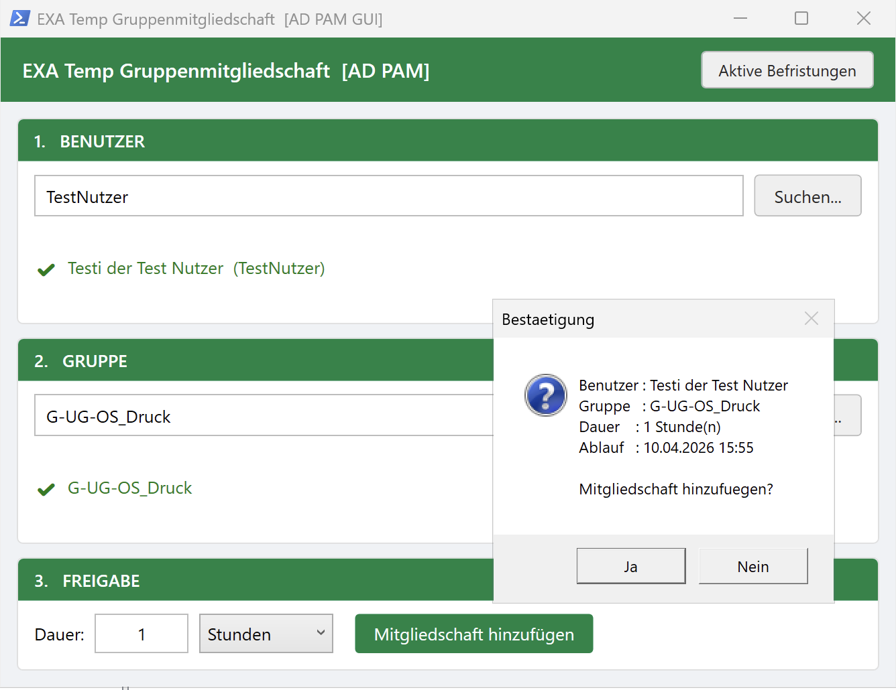
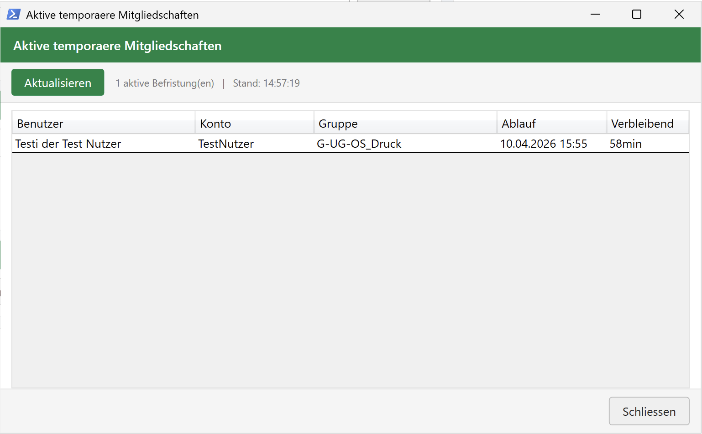

# TempGroupManager

A PowerShell WPF GUI tool for managing **temporary Active Directory group memberships** using the built-in AD Privileged Access Management (PAM) feature. Memberships expire automatically via TTL — no scheduled tasks or manual cleanup needed.

---

## How it works

Active Directory's PAM feature allows adding a user or a group to a group with a Time-To-Live (TTL) in seconds. When the TTL expires, AD removes the membership automatically at the domain controller level. This tool wraps that mechanism in a guided 3-step GUI.



The main window is divided into three sections:

### Step 1 — Member (user or group)

Choose whether a **Benutzer** (user) or a **Gruppe** (group) should become the temporary member.

**User mode:** Enter a name or account name in the text field and press **Enter** or click **Suchen**. A search dialog opens showing matching AD accounts with display name, logon name, and department.



Select the user by double-clicking or via **OK**. The selected user is confirmed with a checkmark below the search field.

**Group mode:** Search works like the group search in step 2. Only Global groups can be selected. The status line shows the number of direct members. Use this when a whole team needs temporary access to a resource that is controlled by another group (e.g. 100 days).

> **Scope:** Nesting a group grants access to *all current and future* members of that group for the whole duration. The confirmation dialog shows a warning for this case.
>
> Memberships are additive: users who already have access through another group keep it after the temporary nesting expires. Only the temporary link between the two groups is removed.

### Step 2 — Group

Works the same way as the user search. Enter a group name (partial matches supported) and select from the results. Only Global security groups are shown, as AD PAM only supports this scope.

### Step 3 — Freigabe (Grant access)

Set the duration in **hours** or **days** (minimum: 1 hour, maximum: 8760 hours = 1 year). Click **Mitgliedschaft hinzufügen** to apply. A confirmation dialog summarizes member, group, duration, and calculated expiry time before anything is written to AD.



After confirming, the membership is added with the specified TTL. AD removes it automatically when the time runs out.

### Active memberships view

Click **Aktive Befristungen** in the top right to open an overview of all currently active temporary memberships domain-wide. It shows member, type (user/group), account, group, expiry timestamp, and remaining time. Use **Aktualisieren** to refresh the list.



---

## Requirements

| Requirement | Details |
|---|---|
| Domain Functional Level | Windows Server 2016 or higher |
| AD PAM Feature | Must be enabled (see setup below) |
| PowerShell Module | RSAT ActiveDirectory (`Rsat.ActiveDirectory.DS-LDS.Tools`) |
| PowerShell Version | 5.1+ |
| Permissions | The running account needs write access to the target groups |

Install RSAT if missing:

```powershell
Add-WindowsCapability -Online -Name Rsat.ActiveDirectory.DS-LDS.Tools~~~~0.0.1.0
```

---

## One-time AD setup

Run **once** on a domain controller as Domain Admin. This enables the PAM feature forest-wide:

```powershell
Enable-ADOptionalFeature `
    -Identity 'Privileged Access Management Feature' `
    -Scope ForestOrConfigurationSet `
    -Target 'yourdomain.com'
```

> **Note:** This change is irreversible. Once enabled, the PAM feature cannot be disabled.

---

## Usage

### Launch directly

```powershell
.\TempGroupManager_v3.ps1
```

### Deployment via shortcut (all users)

To deploy the tool centrally (e.g. from a network share) and make it available in the Start Menu, use the following script. Adapt the paths to your environment.

```powershell
$scriptPath    = "\\domain\share\Scripts\TempGroupManager_v3.ps1"
$shortcutPath  = "C:\ProgramData\Microsoft\Windows\Start Menu\Programs\TempGroupManager.lnk"

$wsh           = New-Object -ComObject WScript.Shell
$shortcut      = $wsh.CreateShortcut($shortcutPath)
$shortcut.TargetPath   = "C:\Windows\System32\WindowsPowerShell\v1.0\powershell.exe"
$shortcut.Arguments    = "-NonInteractive -WindowStyle Hidden -File `"$scriptPath`""
$shortcut.Description  = "Temporaere Gruppenmitgliedschaft [AD PAM]"
$shortcut.IconLocation = "C:\Windows\System32\dssec.dll,0"
$shortcut.Save()
```

The `-WindowStyle Hidden` flag suppresses the PowerShell console window so only the WPF GUI is visible.

---

## Code signing

If your environment enforces an `AllSigned` or `RemoteSigned` execution policy (recommended), the script must be signed with a trusted code-signing certificate before it will run.

```powershell
# Adapt paths to your environment
$PfxPath    = "\\domain\share\Certificates\CodeSigning.pfx"
$ScriptPath = "\\domain\share\Scripts\TempGroupManager_v3.ps1"

# Load certificate — PowerShell will prompt for the PFX password
$Cert = Get-PfxCertificate -FilePath $PfxPath

# Sign the script
Set-AuthenticodeSignature -FilePath $ScriptPath `
    -Certificate $Cert `
    -TimestampServer "http://timestamp.digicert.com" `
    -HashAlgorithm "SHA256"

# Verify the signature
Get-AuthenticodeSignature -FilePath $ScriptPath
```

> **Important:** Re-sign the script after every change, otherwise the signature becomes invalid and execution will be blocked.

---

## Audit log

Every action is appended to `TempGroupManager_audit.csv` in the script directory.

| EventId | Meaning |
|---------|---------|
| 1001 | Membership successfully added (message contains `(Benutzer)` or `(Gruppe)`) |
| 1099 | Error |

Each entry records timestamp, operator (`DOMAIN\user`), computer name, and a details message. The file is CSV-formatted and can be opened directly in Excel.

---

## Known pitfalls

**PAM only works with Global security groups**
The TTL feature is restricted to Global-scoped groups. Universal and Domain Local groups are not supported by AD PAM.

**Nested groups: a group can't be a member of itself**
The tool blocks selecting the same group as member and target. Circular nesting across several levels (A in B, B in A) is not checked.

**TTL is not a hard guarantee**
The membership expiry is enforced by the domain controller. If a DC is unreachable or replication is delayed, the membership may persist slightly longer than configured.

**Execution policy**
On most hardened environments, running an unsigned script will be blocked. Either sign the script (see above) or adjust the execution policy for the session:
```powershell
Set-ExecutionPolicy -Scope Process -ExecutionPolicy Bypass
```

**Permissions**
The user running the tool needs at least write permission on the `member` attribute of the target groups. Without it, `Add-ADGroupMember` will fail silently in some configurations — check the audit log for EventId 1099.

**RSAT on client machines**
RSAT is not installed by default on Windows 10/11 clients. Without it the tool will not start. Deploy it via GPO or Intune if rolling out to non-admin workstations.

**Network share + signing**
If the script is hosted on a UNC path (`\\server\share\...`), Windows may treat it as coming from the internet zone depending on GPO settings, which can block execution even with a valid signature. In that case, add the share to the trusted intranet zone or use a local copy.

---

## Author

Martin Lee Starke
